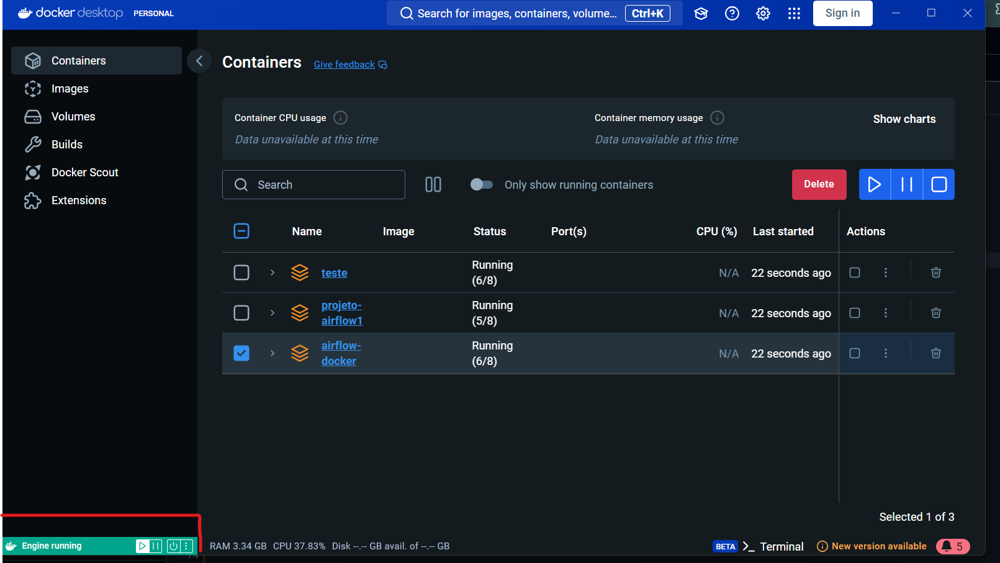
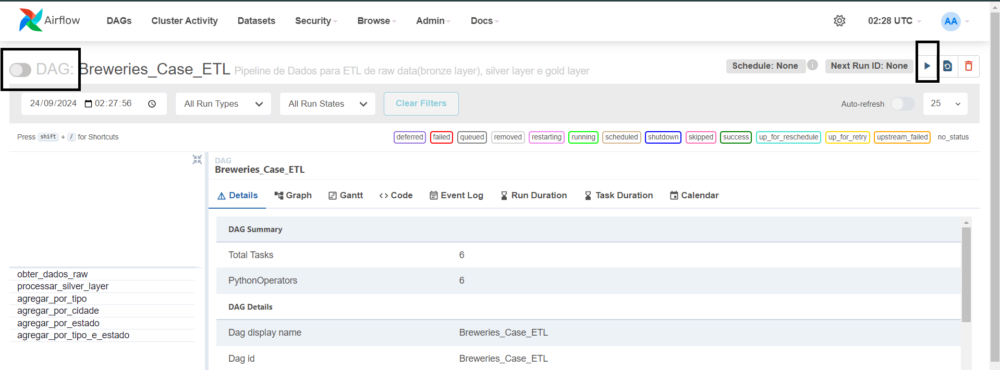
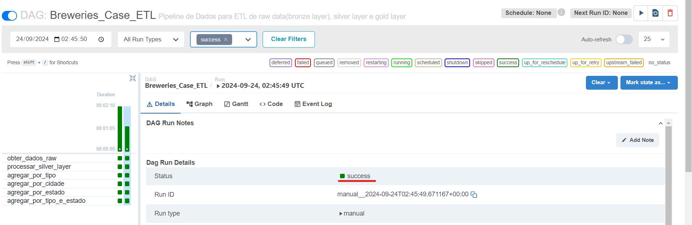
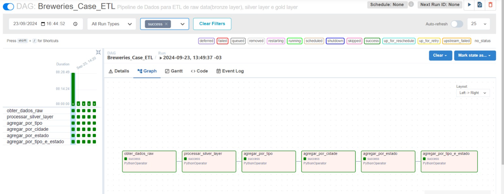

# CASE BREWERIES
O case procura avaliar como um engenheiro de dados lidaria com o dia a dia de uma rotina de processos ETL, lidando com rotinas de containers, orquestração, monitoramento, seguindo a arquiteura de dados medalhão para montar um Data Lake..

* Camada Bronze(Raw) - Local de ingestão dos dados 'crus' onde serão recebidos os arquivos originais, das mais diversas fontes como APIS (exemplo do case), arquivos CSV,Parquet, bancos de dados entre outros.
* Camada Silver - A camada onde os dados advindos da camada bronze são transformados, limpos e processados.
* Camada Gold - Camada onde os dados são agregados preparados para análise, processos de BI e dashboards. Um estado de dado mais próximos das camadas de negócio.

# Escolhas de Modelagem
Por escolhas de modelagem os arquivos irão ser usados localmente na estrutura de pastas do sistema. Irão ter 3 pastas: raw_data,silver_layer e gold_layer onde os arquivos gerados pelo processo serão salvos. Poderiamos adotar uma estrutura com buckets em cloud e tabelas em um servidor, mas para esse projeto creio que atenda os fins, que é gerar um processo de ETL com os arquivos das camadas bronze, silver e gold. A aplicação criará automaticamente todas as pastas de raw_data, silvar_layer e gold_layer.

# Estrutura do Projeto
Para o projeto foi escolhida a seguinte estrutura:
* Dags - É o arquivo que contém todo o processo, desde preparar dados raw, passar para silver e gold. Nele também consta as instruções da DAG e as tasks. Como o projeto era relativamente pequeno, não foi escolhido particionair em vários códigos como por exemplo um para cada camada e suas respectivas tasks. Em um projeto maior é necessário esse particionamento.

* raw_data - É a pasta onde os arquivos gerados pela camada bronze irão ser armazenados em seu formato JSON com a data de ingestão no fim de cada nome.

* silver_layer - É a pasta onde os arquivos gerados pela camada silver irão ser armazenados em seu formato PARQUET particionados por localização (Country, State, City) com a data de ingestão no fim de cada nome.

* gold_layer - É a pasta onde os arquivos gerados pela camada gold com as agregações de cervejarias por cidade, por estado, por tipo de cervejarias(seu tamanho) e uma visão de tipos por estados irão ser armazenados em seu formato PARQUE com a data de ingestão no fim de cada nome.

* Docker-compose.yaml - Arquivo de configuração do docker-compose.

* Dockerfile - É um arquivo de texto que contém uma série de instruções para automatizar a criação de imagens Docker.

* Requirements.txt - Arquivo onde consta as bibliotecas a serem baixadas.

```
/ ETL_CASE_MEDALLION
│
├── dags/                            
│   ├── breweries_etl_pipeline.py
├── raw_data/                            
│   ├── bronze_breweries_AAAA-MM-DD.json        #Arquivos da camada Bronze com data de ingestao no formato AAAA-MM-DD
├── silver_layer/                            
│   ├── silver_particionado_AAAA-MM-DD.parquet  #Arquivos da camada Silver com data de ingestao no formato AAAA-MM-DD    
├── gold_layer/                         
│   ├── gold_agg_cidades_cervejarias_AAAA-MM-DD.parquet  # Arquivos da camada Gold com data de ingestao no formato AAAA-MM-DD
│   ├── gold_agg_estado_cervejarias_AAAA-MM-DD.parquet
│   ├── gold_agg_tipo_cervejarias_AAAA-MM-DD.parquet
│   ├── gold_agg_tipos_por_estado_cervejarias_AAAA-MM-DD.parquet                
├── docker-compose.yaml                 
├── Dockerfile                          
├── requirements.txt                     
├── README.md                            
```

# Instalação

* Instalar o [Docker Desktop](https://docs.docker.com/desktop/).
 Instale a versão referente ao seu sistema operacional e siga os passos de instalação completa.

# Passos
1. Abra o Docker Desktop e cerfique que está online, no lado esquerdo inferior tem que estar verde "Engine Running".


2. Baixe o projeto ou de um git clone para seu diretório
```
git clone "https://github.com/willrob04/ETL_Case_Medallion.git"
```
3. Testar a instalacao com os comandos.
```
docker version
```
4. Entrar no terminal e acessar o diretório onde se encontra os arquivos do projeto e iniciar a aplicação

```
docker-compose up 
```


5. Após os containers subirem acessar o link do Airflow.
```
http://localhost:8080
```
6. Logar no Airflow com usuário airflow e senha airflow

7. Ao acessar o Airflow abra a DAG "Breweries_Case_ETL" 

8. Despause a DAG no canto superior esquerdo e coloque para rodar na setinha azul superior a direita 'Trigger Dag'


9. Assim que a DAG executar conferir se status está como 'success'


10. Conferir se todas as tasks se completaram ao clicar no menu 'Graph'



11. Para encerrar a aplicação no terminal
```
docker-compose down
```


# Futuras Melhorias identificadas:
* Deploy do projeto em ambiente cloud
* Criação de um database e com as tabelas para conter as informações das camadas
* Implementação de testes unitários
* Implementação de monitoramento dos arquivos.
* Caso o escopo do projeto crescesse, modularizar as funções com um arquivo python para cada camada e de orquestração.

